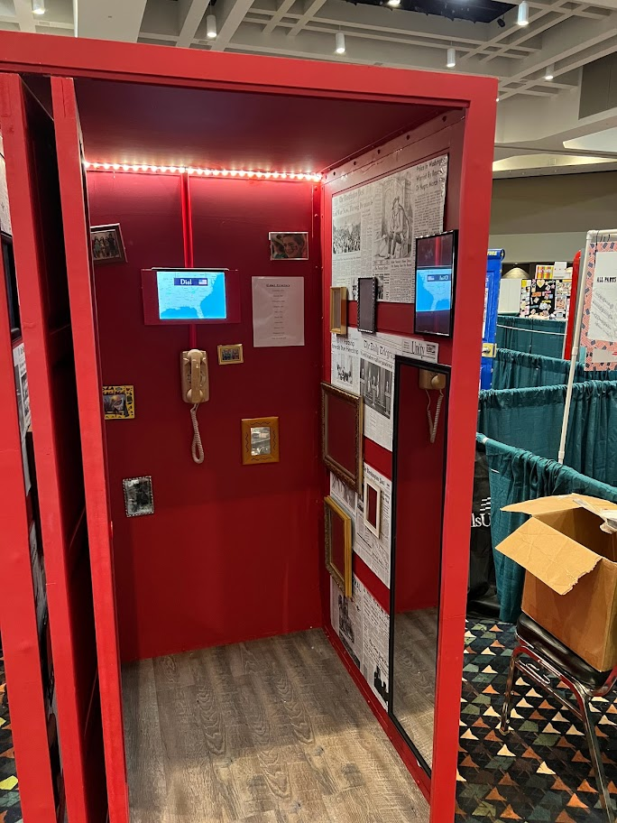
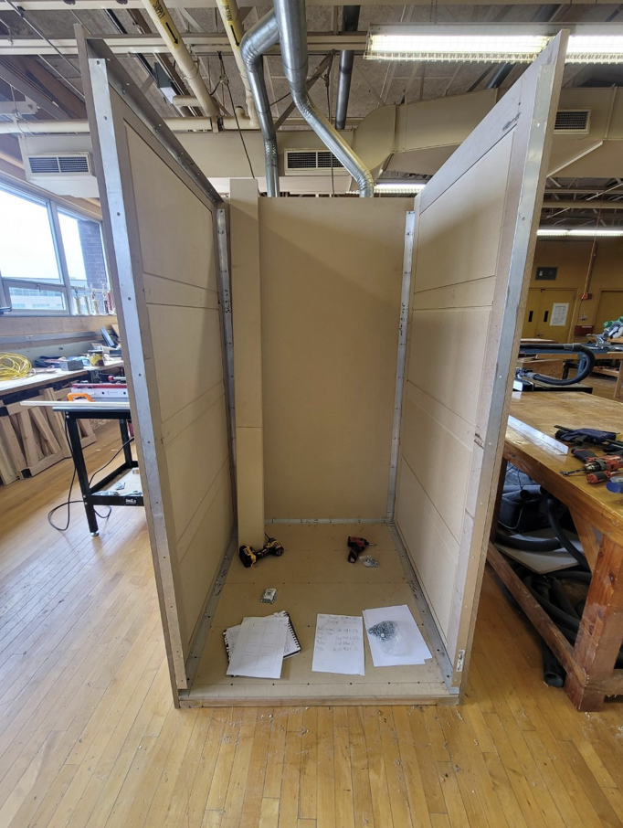
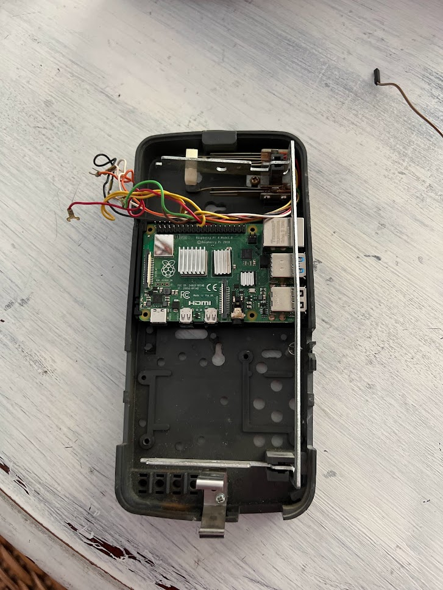
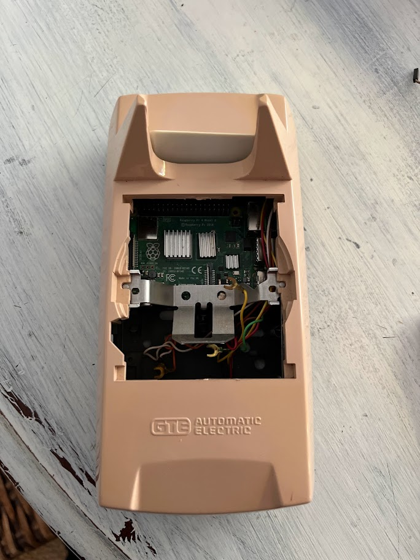

# Digital-Phonebooth
In my senior year at Platt Technical Highschool I joined a team of three to compete in Skills USA 2022 in the chapter display category. The theme was "United as One" and we were tasked with building a multidisciplinary project that represent it. I worked with a carpentry student and an architecture student to build a digitized phone booth that would play audio clips from around the world through a genuine rotary phone.

### Hardware
While I did a fair bit of sanding, painting, and touchup work, the majority of what I did was related to the rotary phone and the tablet that would act as a visual component to it. I sourced a genuine rotary phone from an old school closet and used a multimeter to determine how it functioned in order to connect it to a Raspberry Pi. Once I determined the pulse patterns and which switches triggered when, I was ready to connect the rotary dial to the GPIO pins on a Raspberry Pi. 

### Software
After connecting the rotary phone to the Pi, my next step was software. I used python to write a simple script to take pulses from the phone and convert them to USB keyboard signals that would output to a connected tablet. Essentially, I turned the rotary phone into a glorified numpad. Additionally, I connected the hangup switch to the space key so I could determine when the phone was on or off the stand.

Next, I removed the internals of the phone to place the PI inside and began to work on the visual and audio component. For this I created a program in Unity that would let you dial an area code and would move a map to that location. It would then play an audio recording from someone who lived there. Additionally the program would show a slideshow that corresponded to the audio. I sourced these audio clips from friends I had made both in America and during my time in Singapore who had lived or were living in other countries. The audio would play through the original handset making the dialing, hangup, and audio of the rotary phone fully functional.

### SkillsUSA
For the competition we won our State and while we didn't get on the podium at nationals, we got a great score, and had the opportunity to present our project as well as receive some valuable feedback from judges.

